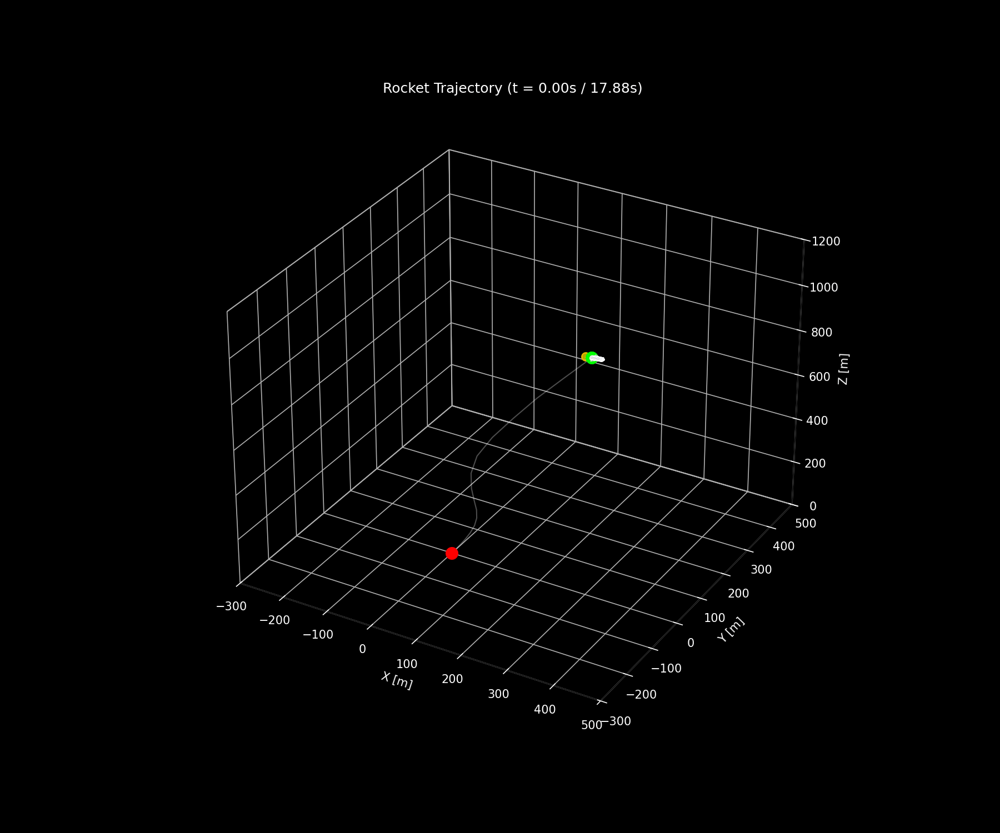
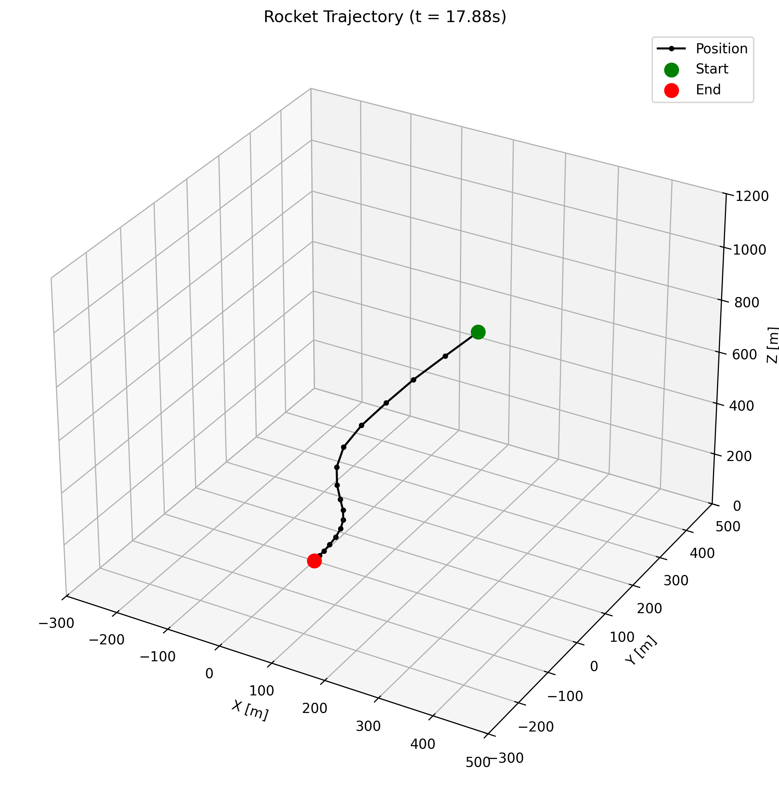
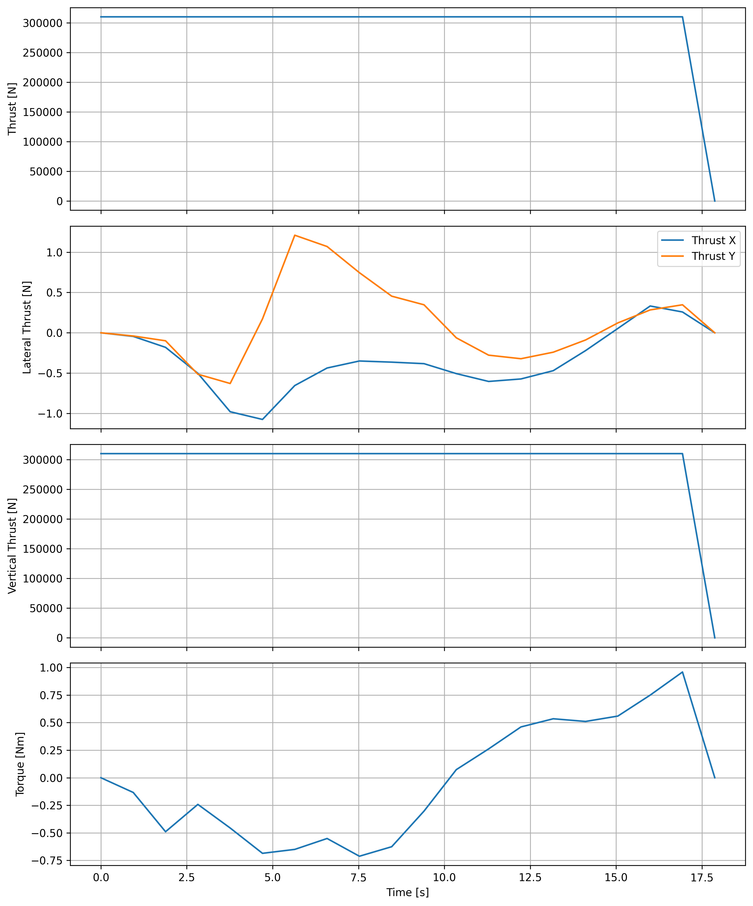
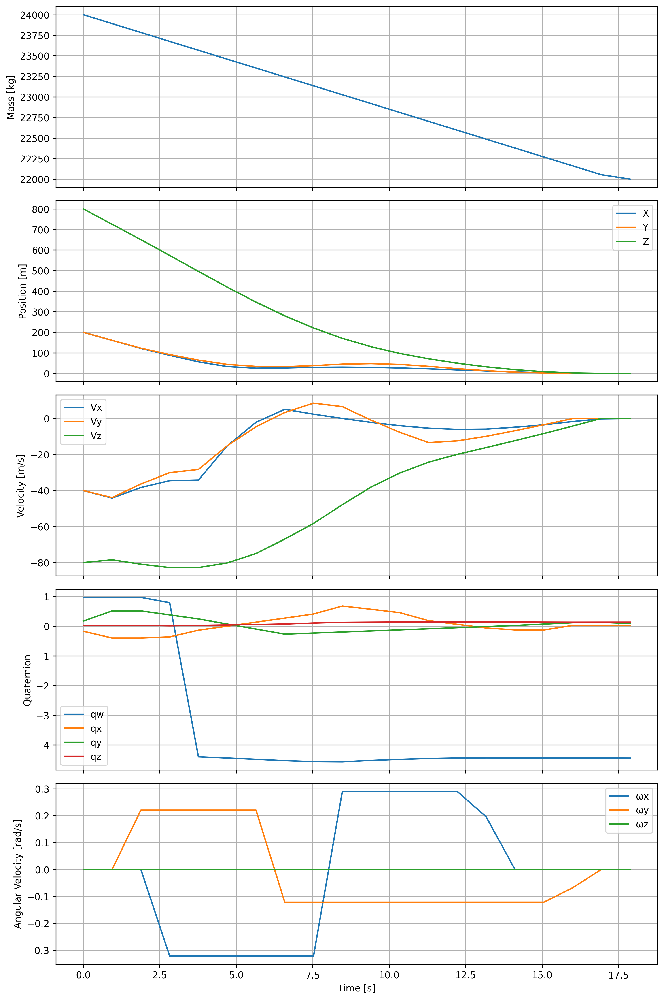
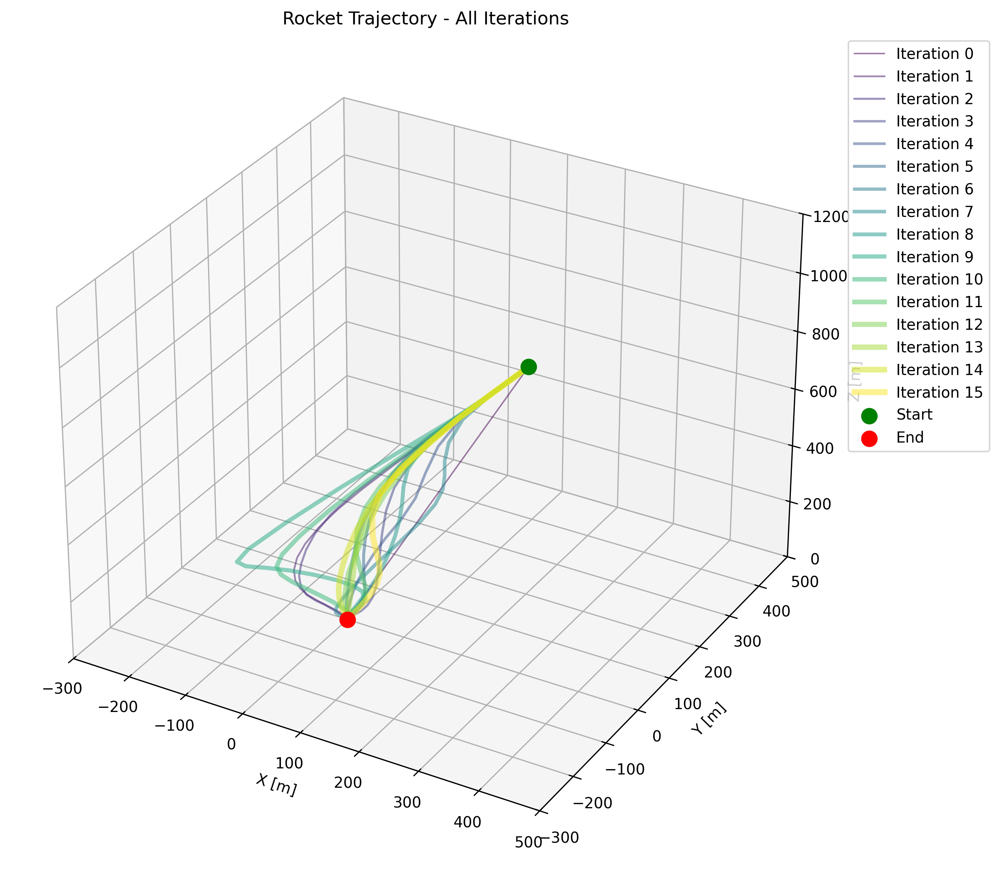

# Rocket Landing Trajectory Optimization

This project implements a 3D rocket landing trajectory optimization algorithm using Successive Convexification (SCvx). The algorithm computes optimal control trajectories for landing a rocket, similar to how SpaceX lands their Falcon 9 boosters.

## Overview

The trajectory optimization uses a 3D rocket model with quaternion-based attitude representation. The optimization problem is solved iteratively by:

1. Linearizing the nonlinear rocket dynamics around the current trajectory
2. Converting the problem into a convex optimization problem (SOCP)
3. Solving the convex problem to find trajectory updates
4. Iterating until convergence

## Features

- 3D rocket dynamics with 14 state variables (mass, position, velocity, quaternion, angular velocity)
- Control inputs include thrust vector and torque
- Real-world constraints including:
  - Minimum and maximum thrust
  - Glideslope constraints
  - Maximum gimbal angle
  - Maximum tilt angle 
  - Maximum angular velocity
- Free final time optimization
- Visualization of trajectories and control profiles

## Requirements

```
numpy
scipy
matplotlib
cvxpy
```

Install dependencies with:
```bash
pip install -r requirements.txt
```

## Usage

Run the main script to solve the trajectory optimization problem:

```bash
python main.py
```

## Example Results

### Rocket Trajectory

The algorithm finds an optimal trajectory for the rocket to land from its initial position to the target landing site.





### Control Profiles

The optimization finds an optimal thrust profile and gimbal control sequence.



### State Evolution

The state variables (position, velocity, orientation, etc.) evolve smoothly over time.



### Convergence

The algorithm typically converges within several iterations. Each iteration improves the trajectory solution.



## Code Structure

- `main.py`: Main script that runs the optimization
- `data_types.py`: Classes for parameters and trajectory data
- `dynamics.py`: Rocket dynamics and simulation
- `utils.py`: Utility functions including quaternion operations
- `SOCP.py`: Second-order cone programming problem formulation

## Theory

The algorithm is based on the Successive Convexification approach described in the papers:

- "Successive Convexification: A Superlinearly Convergent Algorithm for Non-convex Optimal Control Problems"
- "Successive Convexification for 6-DoF Mars Rocket Powered Landing with Free-Final-Time"

The approach allows for solving nonlinear optimal control problems by iteratively solving a sequence of convex programming problems.

## Acknowledgments

This implementation is inspired by the C++ implementation by Sven Niederberger (EmbersArc) in the SCpp repository, translated and adapted to Python.